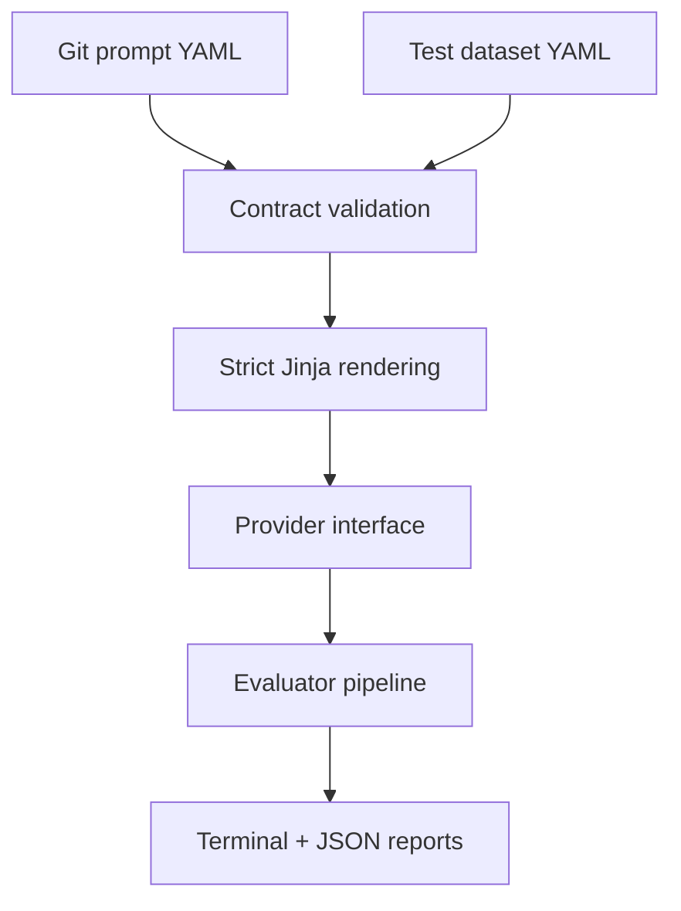

<div align="center">

# 🧪 Prompt Laboratory

**Treat prompts like production software: versioned, validated, tested, and evaluated before release.**

[](https://github.com/Anne07-Ai/prompt-laboratory/actions/workflows/ci.yml)
[](https://www.python.org/)
[](https://docs.pydantic.dev/)
[](LICENSE)

</div>

Prompt Laboratory is a Git-native platform for AI engineering teams to create, version, test,
evaluate, and compare prompts before they reach production. It is provider-neutral and designed
for healthcare, finance, retail, HR, legal, education, manufacturing, and other industries.

> **Current status — Phase 2:** the repository now supports a complete offline evaluation run:
> validated prompt and dataset loading, strict rendering, normalized mock execution, deterministic
> evaluators, terminal summaries, and structured JSON reports. Real model adapters begin in Phase 3.

## Why this product?

Prompts often live as unstructured strings inside application code. That makes changes difficult
to review, reproduce, compare, and approve. Prompt Laboratory makes a prompt a first-class,
version-controlled engineering artifact.

## Architecture



Phase 2 uses a deterministic mock provider so development and CI need no credentials or network.
Real providers will implement the same request/response contract in Phase 3.

## Quick start

```bash
python -m venv .venv
source .venv/bin/activate
python -m pip install -e ".[dev]"

prompt-lab evaluate \
  --prompt prompts/education/concept-explanation.yaml \
  --dataset datasets/education/concept-explanation.yaml \
  --output reports/education.json
```

Example terminal result:

```text
Prompt: education.concept-explanation@1.0.0
Provider: mock/local-deterministic
Cases: 1 | Passed: 1 | Pass rate: 100.0% | Average score: 1.000
Report: reports/education.json
```

The JSON report contains rendered prompts, normalized provider responses, token estimates,
per-evaluator evidence, per-case status, and aggregate metrics. This makes every result auditable.

## Prompt and dataset contracts

Prompt definitions declare identity, semantic version, owners, Jinja variables and output shape.
Datasets bind to one exact prompt ID and version. Each Phase 2 case supplies typed inputs, a
deterministic mock response and at least one expectation:

```yaml
schema_version: "1.0"
prompt_id: education.concept-explanation
prompt_version: "1.0.0"
cases:
  - id: photosynthesis-primary
    inputs:
      concept: photosynthesis
      learning_level: primary school
    mock_response: >-
      Photosynthesis helps plants use sunlight to make food.
    expected:
      keywords: [plants, sunlight, food]
```

Unknown fields, duplicate case IDs, empty expectations, prompt-version mismatches and invalid
runtime inputs fail before evaluation.

## Deterministic evaluators

| Evaluator | Behaviour | Score |
|---|---|---:|
| Exact match | Normalized or case-sensitive text comparison | 0 or 1 |
| Keyword check | Measures required keyword coverage | 0–1 |
| JSON Schema | Parses JSON and validates the prompt output schema | 0 or 1 |

An applicable evaluator must pass for the case to pass. Similarity and LLM-as-judge remain Phase 3
features because they are non-deterministic or require model dependencies.

## Cross-industry fixtures

| Industry | Demonstration | Safety boundary |
|---|---|---|
| Healthcare | Patient-friendly explanation | No diagnosis or prescribing |
| Finance | Financial document summary | No investment advice |
| Retail | Policy-grounded support response | No invented resolution |
| HR | Structured CV extraction | No inferred protected attributes |
| Legal | Contract clause identification | No legal advice |
| Education | Level-adapted concept explanation | Explanation and knowledge checks |

These fixtures are synthetic demonstrations, not validated professional systems.

## Development

```bash
python -m pip install -e ".[dev]"
python -m ruff check src tests
python -m pytest
```

## Development roadmap

- [x] Phase 1 — typed YAML prompt contract, loader, renderer, samples, and tests
- [x] Phase 2 — local datasets, mock provider, deterministic evaluators, CLI, and JSON reports
- [ ] Phase 3 — provider adapters, model comparison, cost/latency, similarity, and LLM-as-judge
- [ ] Phase 4 — pull-request evaluation and configurable regression gates
- [ ] Phase 5 — FastAPI, PostgreSQL, Streamlit, and Docker
- [ ] Phase 6 — release documentation, screenshots, demonstration, and v0.1.0

## Design boundaries

Git is the source of truth for prompts. PostgreSQL will later store run history rather than replace
Git. LLM-as-judge will supplement deterministic evaluation, never replace it. Authentication,
production A/B testing, hosted execution, billing, and production prompt deployment remain outside
the first MVP.

## License

Apache-2.0.
