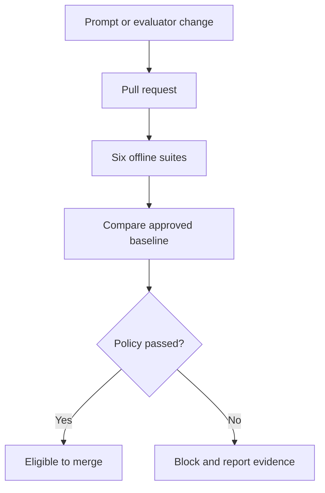

<div align="center">

# 🧪 Prompt Laboratory

**Treat prompts like production software: versioned, validated, tested, and evaluated before release.**

[](https://github.com/Anne07-Ai/prompt-laboratory/actions/workflows/ci.yml)
[](https://github.com/Anne07-Ai/prompt-laboratory/actions/workflows/prompt-evaluation.yml)
[](docs/phase4-automation.md)
[](LICENSE)

</div>

Prompt Laboratory is a Git-native, cross-industry platform for creating, versioning, testing,
evaluating, and comparing prompts before production release.

> **Current status — Phase 4:** prompt changes are automatically evaluated on pull requests.
> Configurable quality gates compare current results with approved baselines and produce auditable
> reports, GitHub summaries, and downloadable evidence.

## Quality-gated lifecycle



The default PR gate is deterministic and credential-free. It tests the whole cross-industry suite
because shared renderer, provider, or evaluator changes can affect prompts that were not directly
edited.

## Run locally

```bash
python -m pip install -e ".[dev]"
python scripts/evaluate_repository.py \
  --output reports/ci \
  --policy configs/regression-policy.yaml \
  --baseline baselines/mock-baseline.json
```

Outputs:

- one detailed JSON report per prompt
- machine-readable `gate-results.json`
- Markdown `summary.md`
- non-zero exit status when any gate fails

## Regression policy

```yaml
minimum_pass_rate: 1.0
minimum_average_score: 0.95
maximum_pass_rate_drop: 0.0
maximum_average_score_drop: 0.02
maximum_cost_increase_ratio: null
maximum_latency_increase_ratio: null
```

Absolute thresholds prevent weak baselines from legitimizing poor results. Delta thresholds prevent
a previously strong prompt from silently becoming worse. Baselines never update themselves.

See [Phase 4 automation design](docs/phase4-automation.md) and
[Phase 3 advanced evaluation](docs/phase3-advanced-evaluation.md).

## Product capabilities

- typed, versioned YAML prompt contracts
- strict Jinja2 rendering and runtime input validation
- cross-industry YAML test datasets
- OpenAI, Anthropic, local, and mock providers
- exact match, keywords, JSON Schema, similarity, and LLM-as-judge
- token, latency, estimated-cost, prompt-version, and model comparison
- pull-request quality gates and structured regression evidence

## Roadmap

- [x] Phase 1 — prompt contracts and strict rendering
- [x] Phase 2 — offline evaluation engine and structured reports
- [x] Phase 3 — providers, advanced evaluation, pricing, and comparison
- [x] Phase 4 — pull-request automation and regression gates
- [ ] Phase 5 — FastAPI, PostgreSQL, Streamlit, and Docker
- [ ] Phase 6 — screenshots, demonstration, documentation, and v0.1 release

## Safety boundaries

Healthcare, finance, HR, and legal fixtures are synthetic demonstrations, not validated
professional systems. Secrets are never stored in prompt or dataset YAML. LLM-as-judge supplements
deterministic checks and never replaces them.

## License

Apache-2.0.
