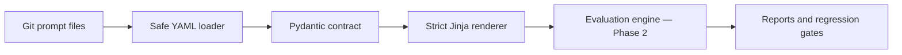

<div align="center">

# 🧪 Prompt Laboratory

**Treat prompts like production software: versioned, validated, tested, and evaluated before release.**

[](https://www.python.org/)
[](https://docs.pydantic.dev/)
[](LICENSE)

</div>

Prompt Laboratory is a Git-native platform for AI engineering teams to create, version, test,
evaluate, and compare prompts before they reach production. It is provider-neutral and designed
for healthcare, finance, retail, HR, legal, education, manufacturing, and other industries.

> **Current status — Phase 1:** prompt contracts, safe YAML loading, strict Jinja2 rendering,
> runtime input validation, and six cross-industry examples are implemented. Model execution and
> evaluation intentionally begin in Phase 2.

## Why this product?

Prompts often live as unstructured strings inside application code. That makes changes difficult
to review, reproduce, compare, and approve. Prompt Laboratory makes a prompt a first-class,
version-controlled engineering artifact.

## Architecture



The canonical prompt remains in Git. Generated run data will be stored separately, and every future
provider will implement one normalized interface so evaluation logic never depends on a vendor SDK.

## Prompt format

```yaml
schema_version: "1.0"
id: education.concept-explanation
version: "1.0.0"
name: Level-adapted concept explanation
description: Explains a concept for a specified learning level.
industry: education
task: explanation
owners: [prompt-laboratory]
tags: [education, explanation]
template: |
  Explain {{ concept }} to a learner at {{ learning_level }} level.
variables:
  concept:
    type: string
    description: Concept to explain.
  learning_level:
    type: string
    description: Target learner level.
output:
  type: text
  description: A level-appropriate explanation.
```

Unknown schema fields are rejected. Missing, unexpected, incorrectly typed, undeclared, and unused
template variables produce actionable errors rather than silently generating a malformed prompt.

## Cross-industry examples

| Industry | Demonstration | Safety boundary |
|---|---|---|
| Healthcare | Patient-friendly explanation | No diagnosis or prescribing |
| Finance | Financial document summary | No investment advice |
| Retail | Policy-grounded support response | No invented resolution |
| HR | Structured CV extraction | No inferred protected attributes |
| Legal | Contract clause identification | No legal advice |
| Education | Level-adapted concept explanation | Explanation and knowledge checks |

These prompts are small demonstrations. They are not validated professional systems.

## Local development

```bash
python -m venv .venv
source .venv/bin/activate
python -m pip install -e ".[dev]"
python -m pytest
python -m ruff check src tests
```

Basic usage:

```python
from prompt_laboratory import PromptRenderer, load_prompt

prompt = load_prompt("prompts/education/concept-explanation.yaml")
text = PromptRenderer().render(
    prompt,
    {"concept": "photosynthesis", "learning_level": "primary school"},
)
print(text)
```

## Development roadmap

- [x] Phase 1 — typed YAML prompt contract, loader, renderer, samples, and tests
- [ ] Phase 2 — local datasets, mock provider, deterministic evaluators, CLI, and JSON reports
- [ ] Phase 3 — provider adapters, model comparison, cost/latency, and LLM-as-judge
- [ ] Phase 4 — pull-request evaluation and configurable regression gates
- [ ] Phase 5 — FastAPI, PostgreSQL, Streamlit, and Docker
- [ ] Phase 6 — release documentation, screenshots, demonstration, and v0.1.0

## Design boundaries

Git is the source of truth for prompts. PostgreSQL will later store run history rather than replace
Git. LLM-as-judge will supplement deterministic evaluation, never replace it. Authentication,
production A/B testing, hosted execution, billing, and production prompt deployment remain outside
the first MVP.

## License

Apache-2.0.
