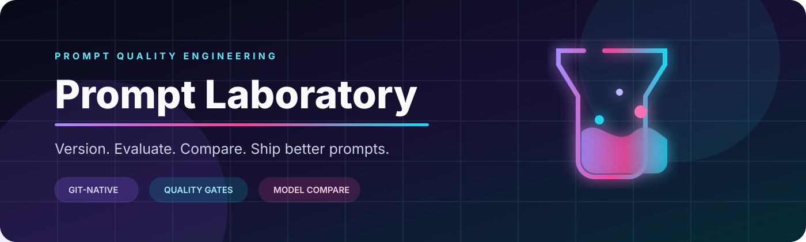
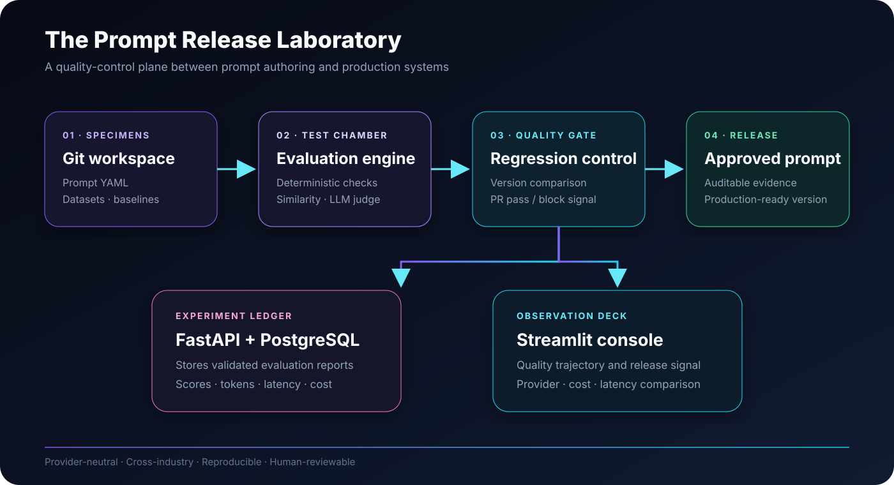
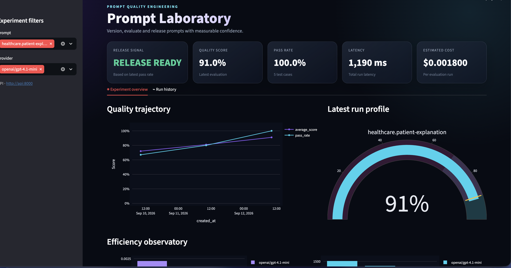

<div align="center">



[](https://github.com/Anne07-Ai/prompt-laboratory/actions/workflows/ci.yml)
[](https://github.com/Anne07-Ai/prompt-laboratory/actions/workflows/prompt-evaluation.yml)
[](RELEASE_NOTES.md)
[](pyproject.toml)
[](LICENSE)

**A Git-native quality engineering platform for prompts.**

Create, version, test, evaluate, compare, and approve prompts before they reach production.

</div>

## Interactive prompt workbench

The Phase 7 workbench makes the prompt catalog directly usable from the experiment console:

- select any Git-versioned YAML prompt
- enter variables through controls generated from the prompt contract
- inspect the fully rendered prompt before execution
- run an offline preview or a configured OpenAI/Anthropic model
- inspect output, latency and token usage without exposing provider credentials to the browser

Prompt files remain the source of truth. The workbench does not silently edit YAML or bypass Git
review. See the [Phase 7 architecture decisions](docs/phase7-interactive-workbench.md).

## Side-by-side model comparison

Phase 8 sends the same rendered prompt to two or more configured providers concurrently. The
comparison view keeps outputs together with latency, total tokens, and estimated cost so model
choices can be reviewed using evidence rather than isolated playground results. A provider failure
is contained to its own result card and does not discard successful responses from other models.

See the [Phase 8 comparison design](docs/phase8-model-comparison.md).

## Why Prompt Laboratory?

Prompts often begin as strings inside application code. As teams and models multiply, those strings
become production dependencies without the controls expected for production software.

Prompt Laboratory moves quality decisions into a reproducible lifecycle:

- prompt contracts live in reviewable YAML
- test datasets make behaviour repeatable
- model adapters make comparisons provider-neutral
- deterministic and model-based evaluators produce measurable evidence
- regression policies block unsafe changes in pull requests
- the experiment console exposes quality, latency, and cost trends

## The release laboratory



Prompt Laboratory is deliberately a **quality-control plane**, not an agent orchestrator or
production traffic router. Approved prompt versions can be consumed by any application, agent,
RAG pipeline, or orchestration platform.

## Start in one command

```bash
git clone https://github.com/Anne07-Ai/prompt-laboratory.git
cd prompt-laboratory
docker compose up --build -d
```

| Surface | Address | Purpose |
|---|---|---|
| Experiment console | <http://localhost:8501> | Quality, cost, latency, and run history |
| OpenAPI | <http://localhost:8000/docs> | Explore the versioned run API |
| Health | <http://localhost:8000/health> | Container/service readiness |

Add a three-version demonstration:

```bash
docker compose exec api python scripts/seed_demo_runs.py
```

Then refresh the experiment console. See the [90-second demonstration guide](docs/demo.md).

## Product preview



The experiment console turns evaluation evidence into a release decision: teams can inspect quality
and pass-rate trends, compare efficiency, filter by prompt and provider, and identify regressions
before a prompt reaches production.

## What the MVP includes

| Capability | Evidence |
|---|---|
| Prompt contracts | Semantic versions, owners, variables, output type/schema |
| Safe rendering | Strict Jinja2 variables plus Pydantic input validation |
| Evaluation | Exact match, keywords, JSON Schema, similarity, and LLM-as-judge |
| Model support | OpenAI, Anthropic, local OpenAI-compatible HTTP, and deterministic mock |
| Observability | Input/output tokens, latency, estimated cost, score, and pass rate |
| Comparison | Prompt versions, providers/models, and approved baselines |
| Release control | Configurable GitHub Actions regression gate and downloadable evidence |
| Product surface | FastAPI, PostgreSQL/SQLite, Streamlit, and Docker Compose |

## Cross-industry demonstrations

The platform is industry-neutral. Synthetic fixtures demonstrate the same engine across:

- healthcare — patient-friendly explanations
- finance — document summaries
- retail — customer-support responses
- HR — structured CV extraction
- legal — contract-clause identification
- education — level-aware concept explanations

These fixtures are demonstrations, not professional advice or validated industry systems.

## Run the quality gate locally

```bash
python -m pip install -e ".[dev]"
python scripts/evaluate_repository.py \
  --output reports/ci \
  --policy configs/regression-policy.yaml \
  --baseline baselines/mock-baseline.json
```

The command writes one JSON report per prompt, `gate-results.json`, and `summary.md`. It returns a
non-zero status when any configured threshold fails.

```yaml
minimum_pass_rate: 1.0
minimum_average_score: 0.95
maximum_pass_rate_drop: 0.0
maximum_average_score_drop: 0.02
maximum_cost_increase_ratio: null
maximum_latency_increase_ratio: null
```

Baselines never update themselves. Human review remains part of approval.

## Repository map

```text
prompts/       versioned YAML prompt contracts
datasets/      repeatable cross-industry test cases
baselines/     human-approved comparison points
configs/       pricing and regression policies
src/           evaluation, providers, API, and persistence
dashboard/     Streamlit experiment console
scripts/       repository gate and demo automation
tests/         unit, integration, and API lifecycle tests
docs/          architecture, phases, and demonstration guide
```

## Development journey

- [x] Phase 1 — prompt contracts and strict rendering
- [x] Phase 2 — offline evaluation engine and structured reports
- [x] Phase 3 — providers, advanced evaluation, pricing, and comparison
- [x] Phase 4 — pull-request automation and regression gates
- [x] Phase 5 — FastAPI, PostgreSQL, Streamlit, and Docker
- [x] Phase 6 — product identity, architecture, demo, and open-source MVP documentation
- [x] Phase 7 — interactive prompt workbench and credential-safe live execution
- [x] Phase 8 — concurrent side-by-side model comparison and safe provider failures

Detailed decisions: [Phase 3](docs/phase3-advanced-evaluation.md) ·
[Phase 4](docs/phase4-automation.md) · [Phase 5](docs/phase5-api-dashboard.md) ·
[Phase 7](docs/phase7-interactive-workbench.md) ·
[Phase 8](docs/phase8-model-comparison.md)

## Safety and release boundaries

- Provider secrets belong in environment/secret management, never prompt or dataset YAML.
- LLM-as-judge supplements deterministic checks; it does not replace them.
- The committed PostgreSQL password is local-development-only.
- Authentication, hosted workspaces, live A/B testing, deployment, and billing remain future scope.

## Release and license

Read the [v0.6.0 release notes](RELEASE_NOTES.md). Licensed under [Apache-2.0](LICENSE).
