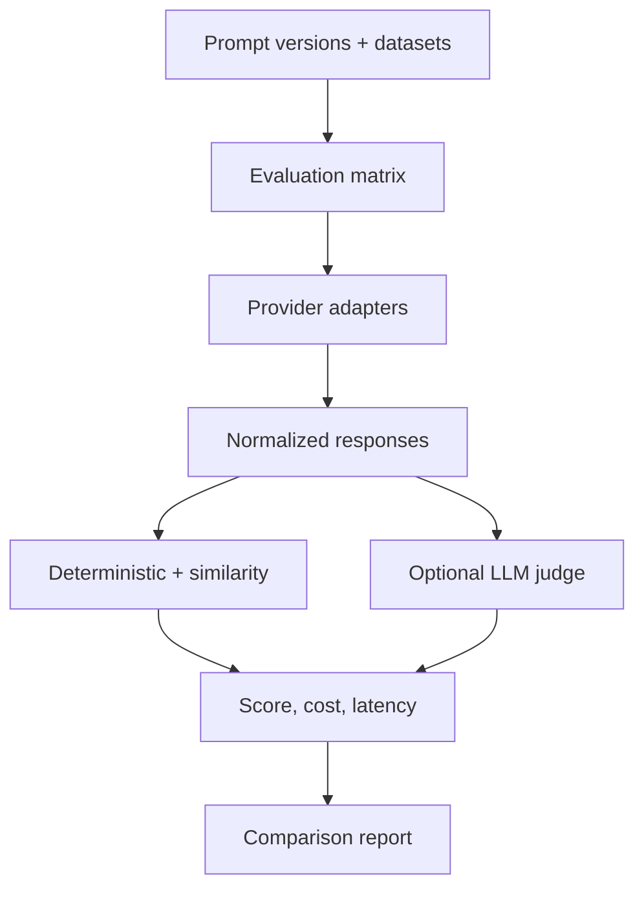

<div align="center">

# 🧪 Prompt Laboratory

**Treat prompts like production software: versioned, validated, tested, and evaluated before release.**

[](https://github.com/Anne07-Ai/prompt-laboratory/actions/workflows/ci.yml)
[](https://www.python.org/)
[](docs/phase3-advanced-evaluation.md)
[](LICENSE)

</div>

Prompt Laboratory is a Git-native, cross-industry platform for creating, versioning, testing,
evaluating, and comparing prompts before production release.

> **Current status — Phase 3:** OpenAI, Anthropic, local, and mock provider adapters; deterministic
> and similarity evaluation; structured LLM-as-judge; version-controlled pricing; token, latency,
> cost, prompt-version, and model comparison are implemented.

## Architecture



Vendor SDK objects never enter the evaluation engine. Each provider returns the same typed response,
so new providers can be added without changing evaluators or reports.

## Quick start: offline evaluation

```bash
python -m venv .venv
source .venv/bin/activate
python -m pip install -e ".[dev]"

prompt-lab evaluate \
  --prompt prompts/education/concept-explanation.yaml \
  --dataset datasets/education/concept-explanation.yaml \
  --output reports/education.json
```

## Provider support

| Provider | Interface | Installation |
|---|---|---|
| Mock | Deterministic local fixture | Base package |
| OpenAI | Responses API | `pip install -e ".[openai]"` |
| Anthropic | Messages API | `pip install -e ".[anthropic]"` |
| Local | OpenAI-compatible HTTP endpoint | Base package |

Real providers use their standard environment credentials. Secrets are never accepted in prompt or
dataset YAML. CI remains offline and credential-free.

## Evaluation methods

| Evaluator | Purpose | Behaviour |
|---|---|---|
| Exact match | Strict expected output | Normalized or case-sensitive |
| Keywords | Required content | Keyword coverage |
| JSON Schema | Structured output | Parse and schema validation |
| Token similarity | Reference comparison | Transparent Jaccard score |
| LLM-as-judge | Rubric-based quality | Strict JSON decision, fail closed |

Deterministic checks remain primary. LLM-as-judge is opt-in and records its provider and reasoning.

## Cost and comparison

Provider adapters capture measured latency and reported token usage. A version-controlled pricing
catalog converts token usage into an estimated USD cost. Pricing values are deliberately external
because provider rates change and must be verified before real reporting.

The comparison engine evaluates multiple prompt versions and models against the same dataset and
reports:

- average quality score and pass rate
- score delta from the selected baseline
- total latency
- input and output tokens
- estimated cost

See [Phase 3 architecture and policy](docs/phase3-advanced-evaluation.md).

## Cross-industry fixtures

Healthcare, finance, retail, HR, legal, and education examples remain synthetic demonstrations.
They are not validated medical, financial, employment, or legal systems.

## Development

```bash
python -m pip install -e ".[dev]"
python -m ruff check src tests
python -m pytest
```

## Roadmap

- [x] Phase 1 — typed YAML prompt contracts and strict rendering
- [x] Phase 2 — offline datasets, mock execution, deterministic evaluation, and reports
- [x] Phase 3 — providers, similarity, LLM judge, pricing, and comparison
- [ ] Phase 4 — pull-request evaluation and configurable regression gates
- [ ] Phase 5 — FastAPI, PostgreSQL, Streamlit, and Docker
- [ ] Phase 6 — screenshots, demonstration, documentation, and v0.1 release

## Design boundaries

Git remains the source of truth for prompts. LLM-as-judge supplements deterministic evaluation and
never replaces it. Production deployment, live A/B testing, authentication, billing, and hosted
execution remain outside the MVP.

## License

Apache-2.0.
