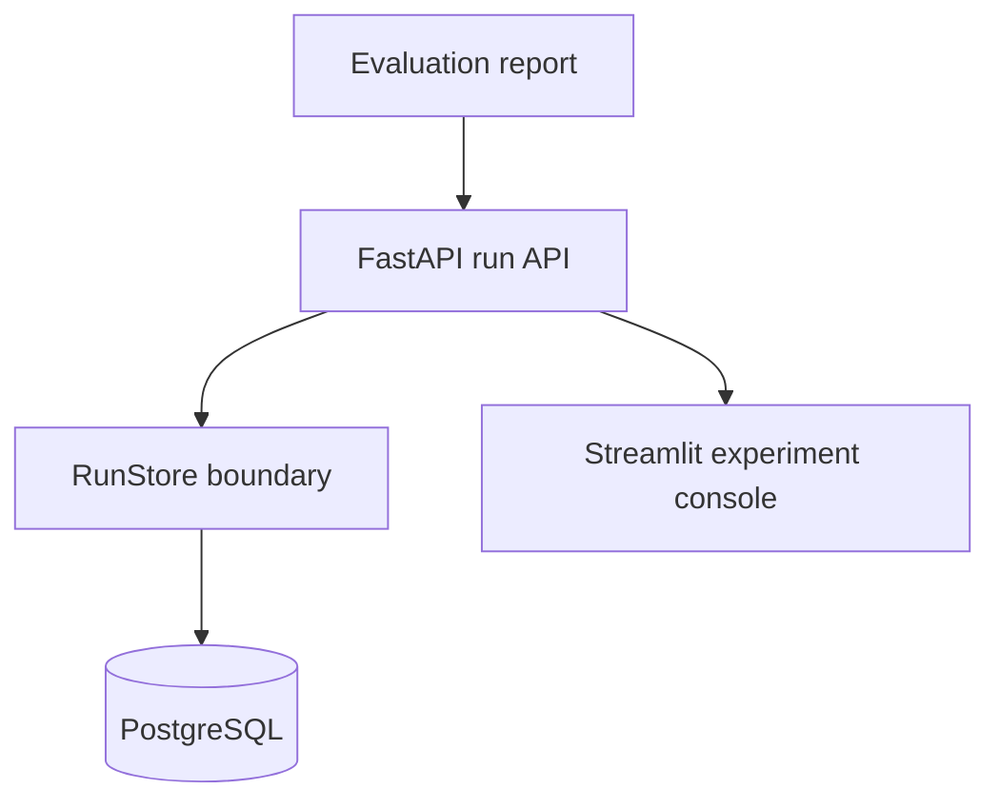

# Phase 5 — API, persistence, and dashboard

Phase 5 turns offline evaluation evidence into a queryable product surface.

## Architecture decisions

- **Evaluation stays framework-independent.** SQLAlchemy is isolated in `storage.py`; prompt
  execution and scoring do not depend on a database.
- **One report is the system contract.** The API persists the existing validated
  `EvaluationReport`, preventing a second incompatible result format.
- **PostgreSQL in production, SQLite locally.** The same repository supports a zero-setup local
  start and a durable production database.
- **Dashboard consumes the API.** Streamlit never connects to PostgreSQL directly, so another UI
  can replace it without migrating storage.
- **No provider secrets in the UI or database.** Evaluation execution remains outside this first
  Phase 5 service boundary.
- **A distinct experiment-console identity.** Violet/cyan signals, release-state cards, filters,
  gauges, and responsive charts make results readable without reusing CGAF-Tune's visual style.

## Service map



## Local Docker start

```bash
docker compose up --build
```

- API documentation: <http://localhost:8000/docs>
- Dashboard: <http://localhost:8501>

The committed Compose password is local-development-only and must be replaced by secret
management in any deployed environment.
